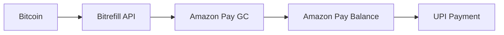

# 🇮🇳 Indian Bitcoin Services Technical Setup
## Self-Hosted Solutions for Indian Regulatory Compliance

### 📋 Additional Services for Indian Families

## 1. Tax Compliance Dashboard

```yaml
# Add to docker-compose.yml
  koinly-bridge:
    image: node:16-alpine
    container_name: koinly-bridge
    restart: unless-stopped
    networks:
      bitcoin:
        ipv4_address: 172.25.0.70
    volumes:
      - tax_data:/app/data
      - ./indian-tax-tracker:/app
    environment:
      - NODE_ENV=production
      - BITCOIN_RPC_HOST=bitcoind
      - BITCOIN_RPC_PORT=8332
      - BITCOIN_RPC_USER=${BITCOIN_RPC_USER}
      - BITCOIN_RPC_PASS=${BITCOIN_RPC_PASS}
    command: npm start
```

### Indian Tax Tracker Application
```javascript
// /opt/bitcoin/indian-tax-tracker/index.js
const express = require('express');
const app = express();

// Track all transactions for Indian tax compliance
app.get('/tax-report', async (req, res) => {
    const transactions = await getTransactions();
    const report = generateIndianTaxReport(transactions);
    res.json(report);
});

function generateIndianTaxReport(transactions) {
    return {
        totalBuys: calculateTotalBuys(transactions),
        totalSells: calculateTotalSells(transactions),
        gains: calculateGains(transactions),
        taxOwed: calculateIndianTax(gains), // 30% + cess
        tdsDeducted: calculateTDS(transactions), // 1% TDS
        schedule_vda: formatForScheduleVDA(transactions)
    };
}
```

## 2. P2P Trading Escrow System

```yaml
  p2p-escrow:
    build: ./p2p-escrow
    container_name: p2p-escrow
    restart: unless-stopped
    depends_on:
      - bitcoind
    networks:
      bitcoin:
        ipv4_address: 172.25.0.71
    volumes:
      - escrow_data:/app/data
    environment:
      - ESCROW_FEE=0.5
      - MIN_CONFIRMATIONS=2
      - SUPPORTED_METHODS=UPI,IMPS,NEFT,PAYTM
```

### P2P Escrow Configuration
```python
# /opt/bitcoin/p2p-escrow/config.py
PAYMENT_METHODS = {
    'UPI': {
        'timeout_minutes': 15,
        'max_amount_inr': 100000,
        'verification': 'screenshot'
    },
    'IMPS': {
        'timeout_minutes': 30,
        'max_amount_inr': 200000,
        'verification': 'utr_number'
    },
    'BANK_TRANSFER': {
        'timeout_minutes': 120,
        'max_amount_inr': 1000000,
        'verification': 'utr_number'
    }
}

SUPPORTED_BANKS = [
    'HDFC', 'ICICI', 'AXIS', 'KOTAK',
    'SBI', 'PNB', 'BOB', 'CANARA'
]
```

## 3. UPI Bridge Service

```yaml
  upi-bridge:
    build: ./upi-bridge
    container_name: upi-bridge
    restart: unless-stopped
    networks:
      bitcoin:
        ipv4_address: 172.25.0.72
    volumes:
      - upi_data:/app/data
    environment:
      - BRIDGE_MODE=gift_cards
      - PRIMARY_PROVIDER=amazon_pay
      - SECONDARY_PROVIDER=paytm
    ports:
      - "8090:8090"  # Tailscale only
```

### UPI Bridge Flow


## 4. Indian Exchange Aggregator

```yaml
  exchange-aggregator:
    build: ./exchange-aggregator
    container_name: exchange-aggregator
    restart: unless-stopped
    networks:
      bitcoin:
        ipv4_address: 172.25.0.73
    environment:
      - EXCHANGES=wazirx,coindcx,zebpay
      - UPDATE_INTERVAL=60
      - PREFERRED_PAYMENT=UPI
    volumes:
      - exchange_data:/app/data
```

### Exchange Aggregator Config
```json
{
  "exchanges": {
    "wazirx": {
      "api_endpoint": "https://api.wazirx.com",
      "requires_kyc": true,
      "fees": {
        "maker": 0.002,
        "taker": 0.002,
        "withdrawal": 0.0005
      },
      "limits": {
        "min_inr": 100,
        "max_inr_daily": 1000000
      }
    },
    "coindcx": {
      "api_endpoint": "https://api.coindcx.com",
      "requires_kyc": true,
      "fees": {
        "maker": 0.001,
        "taker": 0.004
      }
    }
  }
}
```

## 5. Festival Gifting System

```yaml
  festival-gifts:
    build: ./festival-gifts
    container_name: festival-gifts
    restart: unless-stopped
    depends_on:
      - lnd
    networks:
      bitcoin:
        ipv4_address: 172.25.0.74
    environment:
      - LND_HOST=lnd:10009
      - DEFAULT_GIFT_SATS=10000
      - FESTIVAL_THEMES=diwali,holi,rakhi,eid,christmas
```

### Festival Gift Templates
```html
<!-- /opt/bitcoin/festival-gifts/templates/diwali.html -->
<!DOCTYPE html>
<html>
<head>
    <title>🪔 Diwali Bitcoin Gift</title>
    <style>
        body {
            background: linear-gradient(45deg, #ff9933, #ffffff, #138808);
            font-family: 'Arial', sans-serif;
            text-align: center;
        }
        .gift-card {
            background: gold;
            border-radius: 20px;
            padding: 30px;
            margin: 50px auto;
            max-width: 400px;
            box-shadow: 0 10px 30px rgba(0,0,0,0.3);
        }
        .qr-code {
            background: white;
            padding: 20px;
            border-radius: 10px;
            margin: 20px 0;
        }
        .amount {
            font-size: 36px;
            color: #d84315;
            font-weight: bold;
        }
    </style>
</head>
<body>
    <div class="gift-card">
        <h1>🪔 शुभ दीपावली 🪔</h1>
        <p>Digital Gold Gift for You!</p>
        <div class="amount">₹{{amount_inr}} in Bitcoin</div>
        <div class="qr-code">
            
        </div>
        <p>Scan to claim your Bitcoin gift!</p>
        <small>Valid for 24 hours</small>
    </div>
</body>
</html>
```

## 6. Regulatory Compliance Monitor

```yaml
  compliance-monitor:
    build: ./compliance-monitor
    container_name: compliance-monitor
    restart: unless-stopped
    networks:
      bitcoin:
        ipv4_address: 172.25.0.75
    environment:
      - CHECK_INTERVAL=daily
      - ALERT_EMAIL=${ADMIN_EMAIL}
      - TDS_THRESHOLD_INR=10000
      - TAX_RATE=0.30
    volumes:
      - compliance_data:/app/data
```

### Compliance Rules Engine
```python
# /opt/bitcoin/compliance-monitor/rules.py
class IndianComplianceRules:
    def __init__(self):
        self.tds_threshold = 10000  # INR
        self.tax_rate = 0.30
        self.cess_rate = 0.04
        
    def check_tds_requirement(self, transaction):
        if transaction.type == 'SELL' and transaction.inr_value > self.tds_threshold:
            return {
                'requires_tds': True,
                'tds_amount': transaction.inr_value * 0.01,
                'net_amount': transaction.inr_value * 0.99
            }
        return {'requires_tds': False}
    
    def calculate_tax(self, gains):
        tax = gains * self.tax_rate
        cess = tax * self.cess_rate
        return {
            'gains': gains,
            'tax': tax,
            'cess': cess,
            'total_tax': tax + cess
        }
    
    def generate_form_26as(self, transactions):
        # Generate TDS certificate data
        pass
```

## 7. Local Merchant Onboarding

```yaml
  merchant-onboard:
    build: ./merchant-onboard
    container_name: merchant-onboard
    restart: unless-stopped
    depends_on:
      - btcpayserver
    networks:
      bitcoin:
        ipv4_address: 172.25.0.76
    environment:
      - BTCPAY_URL=http://btcpayserver
      - DEFAULT_CURRENCY=INR
      - GST_APPLICABLE=true
    volumes:
      - merchant_data:/app/data
```

### Merchant Templates (Hindi/English)
```javascript
// /opt/bitcoin/merchant-onboard/templates.js
const merchantTemplates = {
    'kirana_store': {
        'en': {
            title: 'Accept Bitcoin at Your Store',
            benefits: [
                'No MDR charges like cards',
                'Instant settlement',
                'Attract young customers',
                'No chargebacks'
            ]
        },
        'hi': {
            title: 'अपनी दुकान पर Bitcoin स्वीकार करें',
            benefits: [
                'कार्ड की तरह कोई MDR चार्ज नहीं',
                'तुरंत पैसा मिलता है',
                'युवा ग्राहकों को आकर्षित करें',
                'कोई चार्जबैक नहीं'
            ]
        }
    }
};
```

## 8. Family Expense Tracker

```yaml
  expense-tracker:
    build: ./expense-tracker
    container_name: expense-tracker
    restart: unless-stopped
    networks:
      bitcoin:
        ipv4_address: 172.25.0.77
    environment:
      - CATEGORIES=groceries,utilities,education,medical,entertainment
      - CURRENCY=INR
      - BITCOIN_PRICE_API=coingecko
    volumes:
      - expense_data:/app/data
```

### Expense Categories (Indian Context)
```json
{
  "categories": {
    "groceries": {
      "hindi": "किराना",
      "typical_monthly": 15000,
      "payment_methods": ["cash", "upi", "bitcoin_voucher"]
    },
    "utilities": {
      "hindi": "उपयोगिताएं",
      "subcategories": [
        "electricity",
        "water",
        "gas",
        "internet",
        "mobile"
      ]
    },
    "education": {
      "hindi": "शिक्षा",
      "includes": [
        "school_fees",
        "tuition",
        "books",
        "online_courses"
      ]
    },
    "festivals": {
      "hindi": "त्योहार",
      "major": [
        "diwali",
        "holi",
        "dussehra",
        "eid",
        "christmas"
      ]
    }
  }
}
```

## 🚀 Quick Deploy for Indian Families

```bash
#!/bin/bash
# /opt/bitcoin/deploy-indian-services.sh

echo "🇮🇳 Deploying Indian Bitcoin Services..."

# Create necessary directories
mkdir -p {p2p-escrow,upi-bridge,exchange-aggregator,festival-gifts}
mkdir -p {compliance-monitor,merchant-onboard,expense-tracker}

# Generate Indian-specific configs
cat > indian-config.env << EOF
# Indian Services Configuration
TDS_THRESHOLD=10000
TAX_RATE=30
PREFERRED_EXCHANGES=wazirx,coindcx
PREFERRED_P2P=localbitcoins,paxful
UPI_PROVIDERS=amazonpay,paytm
GST_APPLICABLE=true
DEFAULT_CURRENCY=INR
FISCAL_YEAR_START=april
EOF

# Pull and start services
docker compose -f docker-compose.yml -f docker-compose.india.yml up -d

echo "✅ Indian services deployed!"
echo "📊 Access tax dashboard at: http://${TAILSCALE_IP}:8091"
echo "💱 P2P trading at: http://${TAILSCALE_IP}:8092"
echo "🎁 Festival gifts at: http://${TAILSCALE_IP}:8093"
```

## 📱 Mobile Apps for Indian Families

### Family Bitcoin Wallet (React Native)
```javascript
// Features for Indian context
const IndianFeatures = {
  // UPI-style addressing
  bitcoinUPI: 'family@bitcoin',
  
  // Festival gift templates
  festivalGifts: {
    diwali: { theme: 'gold', amount: 2100 },
    rakhi: { theme: 'protection', amount: 1100 }
  },
  
  // Bill payment integration
  billPayments: {
    electricity: 'via_voucher',
    mobile: 'direct_recharge',
    dth: 'gift_card'
  },
  
  // Tax tracking
  taxTracking: {
    autoCalculate: true,
    reminderDates: ['March 31', 'July 31']
  }
};
```

## 🎯 Success Metrics for Indian Families

### Compliance Score
- ✅ All transactions recorded
- ✅ Tax payments up to date
- ✅ TDS certificates saved
- ✅ ITR filed with crypto

### Adoption Score
- 📊 % of expenses in Bitcoin
- 👥 Family members onboarded
- 🏪 Local merchants accepting
- 💱 P2P network size

### Privacy Score
- 🔐 KYC exposure minimized
- 🌐 VPN always used
- 💰 Coins mixed regularly
- 📱 Secure communication

---

**Your Indian family Bitcoin setup is ready! Stay compliant, stay sovereign!** 🇮🇳🧡